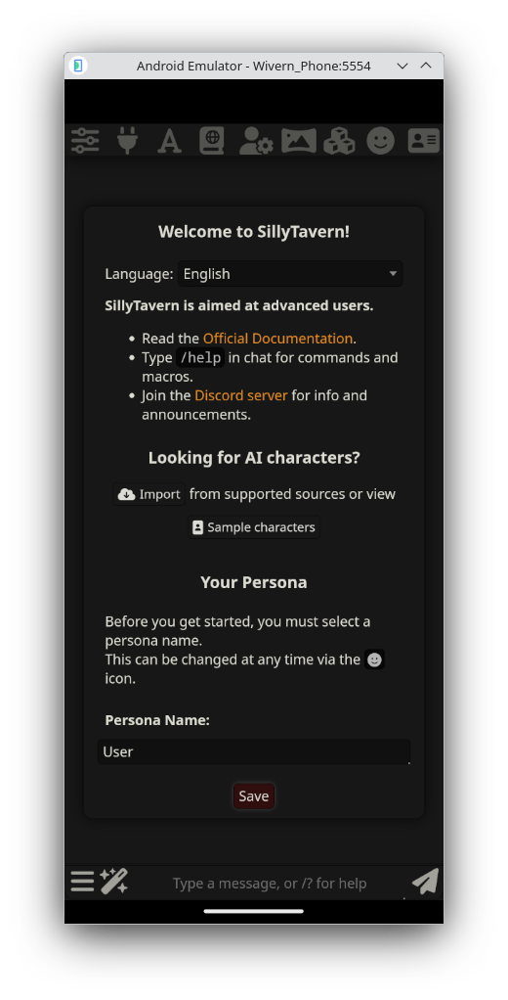
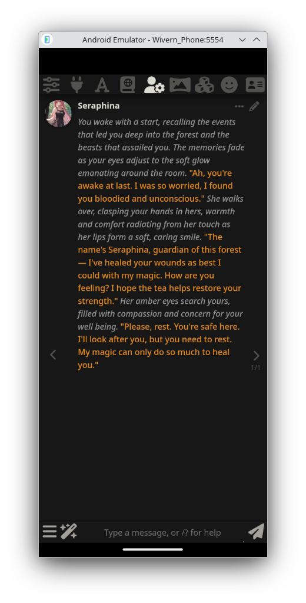
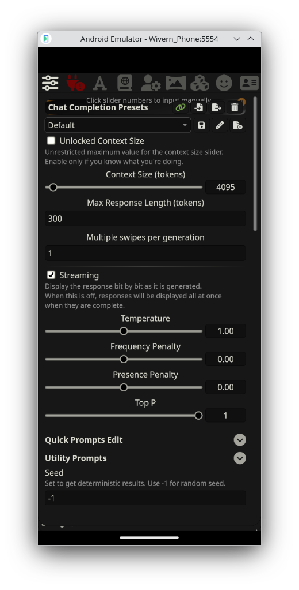

<p align="center">
  <picture>
    
  </picture>
</p>

<h1 align="center">Wivern</h1>
<p align="center"><b>SillyTavern on Android</b></p>
<p align="center">
  A fork of <a href="https://github.com/SillyTavern/SillyTavern">SillyTavern</a> that packages the full server and UI into a single native Android app.
</p>

<p align="center">
  
  &nbsp;&nbsp;
  
  &nbsp;&nbsp;
  
</p>

---

## What is this?

Wivern takes the full [SillyTavern](https://github.com/SillyTavern/SillyTavern) — server, frontend, extensions, everything — and runs it natively on Android. No Termux. No external browser. One app, tap to open, works offline.

Under the hood, the Node.js server runs as an Android foreground service using [nodejs-mobile](https://github.com/nicolo-ribaudo/ppr-prebuilt-nodejs-mobile) (Node 18.20.4 compiled for ARM64/ARMv7/x86_64). The SillyTavern UI loads in a native WebView pointed at `localhost:8000`.

## Architecture

```
┌─────────────────────────────────┐
│         Android App             │
│                                 │
│  ┌───────────┐  ┌────────────┐  │
│  │  WebView  │  │  Node.js   │  │
│  │ (ST UI)   │←→│  Server    │  │
│  │           │  │            │  │
│  └───────────┘  └────────────┘  │
│   localhost:8000   Foreground   │
│                    Service      │
└─────────────────────────────────┘
         ↕ JNI Bridge (C++)
    ┌──────────────┐
    │ nodejs-mobile│
    │  libnode.so  │
    └──────────────┘
```

**First launch** extracts the bundled SillyTavern zip (~180MB) into app-private storage, then starts the server. Subsequent launches skip extraction and boot in a few seconds.

## Changes from upstream SillyTavern

This is a minimal fork. The entire Android wrapper is additive — only one upstream file is modified:

| Change | Why |
|--------|-----|
| `src/transformers.js` — lazy-load the `sillytavern-transformers` module | nodejs-mobile has limited resources; loading the full transformers pipeline at startup is unnecessary overhead |
| `wivern-start.js` — wrapper entry point | Sets the working directory, polyfills `TextDecoder` (nodejs-mobile lacks full ICU), copies default config on first run, then hands off to `server.js` |
| `fix-unicode-regex.mjs` — build-time Babel transform | nodejs-mobile ships without ICU, so `\p{L}`, `\p{N}`, etc. in regex literals cause `SyntaxError` at parse time. This script auto-discovers and transforms all affected files in `node_modules` using `@babel/plugin-transform-unicode-property-regex` |
| `android/` — the native Android app | Java activity with WebView + file picker, foreground service for Node.js, C++ JNI bridge to `libnode.so`, CMake build |
| `build-android.sh` — one-command build | Patches unicode regexes, zips the project, runs Gradle |

Upstream updates from `SillyTavern/SillyTavern` can be merged in normally. The only potential conflict is `src/transformers.js`.

## The ICU problem (and how it's solved)

nodejs-mobile is compiled without ICU (International Components for Unicode). This means:

- **Unicode property escapes** like `/\p{L}/u` throw `SyntaxError` at parse time
- **`TextDecoder`** rejects the `fatal` option
- These patterns appear in **27+ files** across `node_modules` (zod, tiktoken, gpt-3-encoder, highlight.js, webpack, sillytavern-transformers, etc.)

Wivern solves this at build time with `fix-unicode-regex.mjs`, which uses Babel to compile every `\p{}` regex literal down to equivalent character class ranges before bundling. The `TextDecoder` issue is handled by a runtime polyfill in `wivern-start.js` that strips the unsupported `fatal` option.

## Building from source

### Prerequisites

- Linux or macOS (build host)
- Android SDK (API 34), NDK 26.x, CMake 3.22+
- JDK 17
- Node.js 18+
- [nodejs-mobile prebuilt binaries](https://github.com/nicolo-ribaudo/ppr-prebuilt-nodejs-mobile/releases) (`nodejs-mobile-v18.20.4-android.zip`)

### Steps

```bash
# Clone
git clone https://github.com/WivernApp/Wivern.git
cd Wivern
npm install

# Place nodejs-mobile binaries
mkdir -p android/app/libnode
# Extract bin/ and include/ from nodejs-mobile-v18.20.4-android.zip
# into android/app/libnode/

# Point to your Android SDK
echo "sdk.dir=/path/to/android-sdk" > android/local.properties

# Build (patches, zips, compiles — all in one)
./build-android.sh
```

Output: `android/app/build/outputs/apk/debug/app-debug.apk`

### What `build-android.sh` does

1. `npm install` (if needed)
2. Runs `fix-unicode-regex.mjs` to patch `\p{}` patterns in `node_modules`
3. Zips the project (excluding `.git`, `android/`, build artifacts) into `android/app/src/main/assets/sillytavern.zip`
4. Runs `gradlew assembleDebug` to produce the APK

## License

AGPL-3.0, same as upstream SillyTavern.
